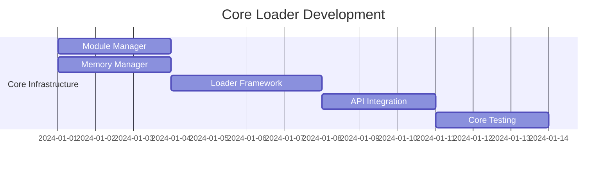
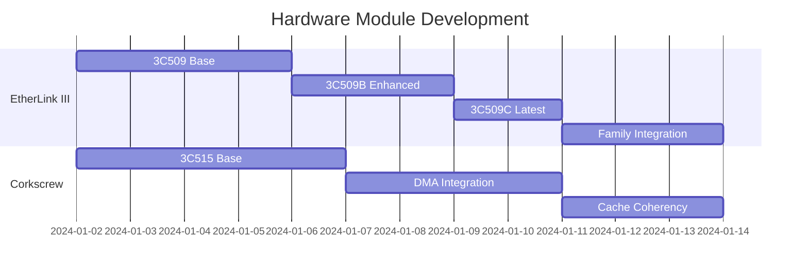
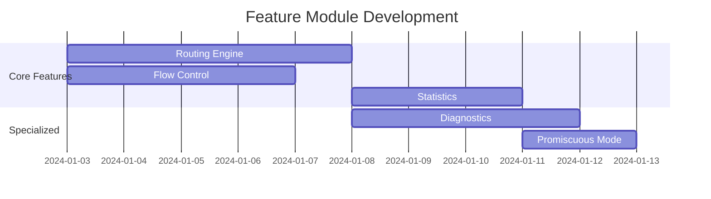
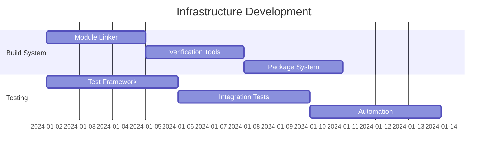
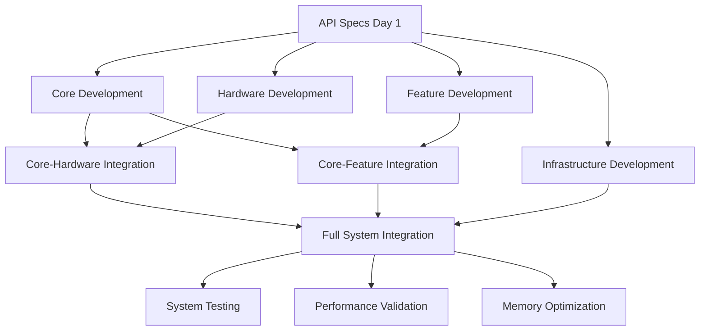

# Phase 3A: Aggressively Parallel Implementation Strategy

## Executive Summary

This document outlines a revolutionary parallel implementation approach for Phase 3A that can achieve **5-week completion in just 2-3 weeks** through strategic parallelization of development tasks. By leveraging independent development streams and aggressive concurrency, we can accelerate delivery while maintaining the highest quality standards.

## Parallel Development Philosophy

### Core Principle: Maximum Concurrency
Instead of sequential development, we implement multiple parallel work streams that converge at strategic integration points:

- **4 Primary Work Streams**: Core, Hardware, Features, Infrastructure
- **Independent Development**: Minimal inter-stream dependencies during development
- **Strategic Convergence**: Controlled integration at defined checkpoints
- **Aggressive Timeline**: 40-60% time reduction through parallelization

### Risk Mitigation Through Design
The modular architecture naturally supports parallel development:
- **Well-Defined Interfaces**: Module APIs established upfront
- **Independent Testing**: Each module can be tested in isolation
- **Incremental Integration**: Modules integrate one at a time
- **Rollback Capability**: Individual modules can be reverted without affecting others

## Parallel Work Stream Architecture

### Stream 1: Core Loader Infrastructure (Critical Path)
**Team**: Core Infrastructure Team  
**Duration**: 2 weeks (Weeks 1-2)  
**Dependencies**: None (can start immediately)



**Key Deliverables**:
- `core_loader.c` - Main loader logic
- `module_manager.c` - Module loading/unloading
- `module_api.h` - Standard module interface
- Core unit tests and validation

### Stream 2: Hardware Module Development (Parallel Track A)
**Team**: Hardware Driver Team  
**Duration**: 2 weeks (Weeks 1-2)  
**Dependencies**: Module API specification (Day 1)



**Parallel Sub-Teams**:
- **Sub-Team A**: ETHRLINK3.MOD development
- **Sub-Team B**: CORKSCREW.MOD development
- **Sub-Team C**: Hardware testing framework

### Stream 3: Feature Module Development (Parallel Track B)
**Team**: Feature Development Team  
**Duration**: 1.5 weeks (Weeks 1.5-3)  
**Dependencies**: Core API specification (Day 2)



**Parallel Sub-Teams**:
- **Sub-Team D**: ROUTING.MOD + FLOWCTRL.MOD
- **Sub-Team E**: STATS.MOD + PROMISC.MOD
- **Sub-Team F**: DIAG.MOD (advanced diagnostics)

### Stream 4: Build System & Infrastructure (Support Track)
**Team**: DevOps/Build Team  
**Duration**: 1.5 weeks (Weeks 1-2.5)  
**Dependencies**: Module format specification (Day 1)



## Aggressive Parallelization Strategy

### Week 1: Maximum Concurrency Launch

#### Day 1 (Monday): Synchronized Start
```
08:00 - ALL TEAMS: Architecture Briefing (1 hour)
09:00 - Release API Specifications (blocking dependency removal)
09:30 - PARALLEL WORK BEGINS:

Stream 1 (Core):     Start module manager framework
Stream 2A (HW-A):    Start ETHRLINK3 base implementation  
Stream 2B (HW-B):    Start CORKSCREW base implementation
Stream 3A (Feat-A):  Start ROUTING engine design
Stream 3B (Feat-B):  Start STATS framework design
Stream 4 (Infra):    Start module linker tools

16:00 - Daily sync (15 min per team, 4 parallel calls)
17:00 - API refinement based on Day 1 learnings
```

#### Day 2-5: Sustained Parallel Development
**Morning Sync Pattern** (8:00-8:30):
- 5-minute status from each stream lead
- Dependency issue resolution
- API evolution coordination
- Resource reallocation if needed

**Evening Integration** (16:00-17:00):
- Cross-stream interface validation
- Integration conflict identification
- Next-day coordination

### Week 2: Parallel Implementation + Early Integration

#### Days 6-10: Development + Rolling Integration
```
CONTINUOUS PARALLEL WORK:
- Stream 1: Core loader near completion
- Stream 2: Hardware modules feature-complete
- Stream 3: Feature modules implementation
- Stream 4: Testing infrastructure ready

ROLLING INTEGRATION STARTS:
- Day 6: Core + ETHRLINK3 integration
- Day 7: Core + CORKSCREW integration  
- Day 8: Core + ROUTING integration
- Day 9: Multi-module testing
- Day 10: Full system integration
```

### Week 3: Integration, Optimization & Validation

#### Days 11-15: Convergence & Completion
```
INTEGRATION PHASE:
- All modules integrate with core loader
- Cross-module functionality testing
- Performance optimization
- Memory footprint validation
- Complete system testing

PARALLEL VALIDATION:
- Hardware testing on real systems
- Feature testing across configurations
- Integration testing with legacy code
- Performance benchmarking
```

## Task Parallelization Matrix

### Independent Development Tasks (Can Run Simultaneously)

| Stream | Team | Tasks | Dependencies |
|--------|------|-------|--------------|
| **Core** | Infrastructure | Module manager, Memory manager, API layer | None |
| **HW-A** | Driver Team A | ETHRLINK3 family implementation | Module API spec |
| **HW-B** | Driver Team B | CORKSCREW family implementation | Module API spec |
| **Feat-A** | Feature Team A | ROUTING + FLOWCTRL modules | Core API spec |
| **Feat-B** | Feature Team B | STATS + PROMISC modules | Core API spec |
| **Feat-C** | Feature Team C | DIAG module (advanced) | Hardware specs |
| **Infra-A** | Build Team A | Module linker + verification | Module format |
| **Infra-B** | Build Team B | Testing framework + automation | Module API |

### Dependency Resolution Strategy



## Critical Path Analysis

### Primary Critical Path (Must Complete First)
1. **API Specification** (Day 1, 4 hours) - BLOCKING
2. **Core Module Manager** (Days 1-4) - CRITICAL
3. **Module Integration Points** (Days 6-8) - CRITICAL
4. **System Integration** (Days 11-13) - CRITICAL

### Secondary Critical Paths (Parallel)
- **Hardware Module Completion** (Days 1-10)
- **Feature Module Completion** (Days 2-11)  
- **Build System Readiness** (Days 1-8)
- **Testing Infrastructure** (Days 2-10)

### Risk Mitigation for Critical Path
```
Day 1: API Spec Delay Risk
- Mitigation: Pre-draft API specs in design phase
- Contingency: 2-hour API workshop with all teams

Days 1-4: Core Development Risk  
- Mitigation: Senior developer on core team
- Contingency: Reduce module manager complexity

Days 6-8: Integration Risk
- Mitigation: Daily integration testing
- Contingency: Rollback to known-good versions
```

## Team Structure & Communication

### Parallel Team Organization

```
PROJECT MANAGER (Coordination)
├── Stream 1: Core Infrastructure Lead
│   ├── Senior Developer (Module Manager)
│   ├── Developer (Memory Management)
│   └── Developer (API Integration)
├── Stream 2: Hardware Team Lead  
│   ├── Sub-Team A: ETHRLINK3 (2 developers)
│   ├── Sub-Team B: CORKSCREW (2 developers)
│   └── Hardware Test Engineer
├── Stream 3: Feature Team Lead
│   ├── Sub-Team D: ROUTING/FLOWCTRL (2 developers)
│   ├── Sub-Team E: STATS/PROMISC (1 developer)
│   └── Sub-Team F: DIAG (1 developer)
└── Stream 4: Infrastructure Lead
    ├── Build Engineer (Module tools)
    ├── Test Engineer (Framework)
    └── DevOps Engineer (Automation)
```

### Communication Protocols

#### High-Frequency Coordination
- **Daily Stand-ups**: 8:00 AM (15 min, all leads)
- **Evening Sync**: 4:00 PM (stream-specific, 15 min each)
- **Slack Channels**: Real-time coordination per stream
- **Integration Windows**: Twice daily (noon, 4 PM)

#### Conflict Resolution
- **API Changes**: Immediate notification + impact assessment
- **Interface Evolution**: Version-controlled with migration path
- **Resource Conflicts**: Project manager arbitration within 1 hour
- **Technical Blockers**: Escalation path to architecture team

## Integration Strategy

### Rolling Integration Approach

#### Phase 1: Core + Hardware (Days 6-7)
```
Day 6 Morning: Core + ETHRLINK3 integration
- Load ETHRLINK3.MOD in core loader
- Verify module header parsing
- Test hardware detection
- Validate vtable binding

Day 6 Evening: Core + CORKSCREW integration  
- Load CORKSCREW.MOD in core loader
- Test DMA integration with cache management
- Verify family detection logic
- Performance baseline testing

Day 7: Dual hardware module testing
- Load both hardware modules simultaneously
- Test multi-NIC detection
- Verify memory layout optimization
- Integration stress testing
```

#### Phase 2: Core + Features (Days 8-9)
```
Day 8: Feature module integration
- ROUTING.MOD integration and testing
- FLOWCTRL.MOD integration and testing  
- STATS.MOD integration and testing
- Module dependency validation

Day 9: Advanced feature integration
- DIAG.MOD integration (init-only testing)
- PROMISC.MOD integration
- Cross-feature functionality testing
- Memory footprint optimization
```

#### Phase 3: Full System (Days 10-11)
```
Day 10: Complete system integration
- All modules loading simultaneously
- Full feature matrix testing
- Performance optimization
- Memory usage validation

Day 11: System validation
- Real hardware testing
- Legacy compatibility verification
- Performance benchmarking
- Production readiness assessment
```

## Quality Assurance in Parallel Development

### Continuous Testing Strategy

#### Unit Testing (Per Stream)
```
Each development stream maintains:
- Module-specific unit tests
- Interface compliance tests  
- Memory leak detection
- Performance regression tests

Automated Execution:
- On every commit
- Before integration attempts
- During daily builds
```

#### Integration Testing (Cross-Stream)
```
Integration Test Matrix:
- Core + Each Hardware Module
- Core + Each Feature Module
- Hardware + Feature combinations
- Full system configurations

Integration Gates:
- No integration without passing unit tests
- Integration tests must pass before next module
- Performance tests verify no regression
```

#### Parallel Validation Teams
```
Validation Team A: Hardware Testing
- Real hardware validation
- Edge case testing
- Performance measurement
- Compatibility verification

Validation Team B: Feature Testing  
- Feature interaction testing
- Configuration matrix testing
- User scenario validation
- Memory optimization verification
```

## Resource Allocation & Scaling

### Human Resources

#### Core Team (Minimum Viable)
- **8 Developers**: Distributed across 4 streams
- **2 Test Engineers**: Hardware + feature validation
- **1 Build Engineer**: Infrastructure and automation  
- **1 Project Coordinator**: Stream synchronization

#### Scaling Options
```
If additional resources available:
- +2 Developers: Accelerate hardware modules
- +1 Test Engineer: Expand integration testing
- +1 Documentation: Parallel doc development
- +1 DevOps: Advanced automation

If resources constrained:
- Combine Stream 3 sub-teams  
- Reduce DIAG.MOD scope
- Simplify build automation
- Serial feature development
```

### Infrastructure Resources

#### Development Environment
```
Parallel Development Infrastructure:
- Dedicated build servers per stream
- Isolated development branches
- Continuous integration per stream
- Shared integration environment

Hardware Testing Lab:
- Multiple test systems with different configurations
- Real 3C509 and 3C515 cards
- Various DOS versions and memory managers
- Network testing equipment
```

## Timeline Compression Analysis

### Traditional Sequential Approach: 5 Weeks
```
Week 1: Core loader development
Week 2: Hardware module development
Week 3: Feature module development  
Week 4: Build system and integration
Week 5: Testing and validation
```

### Aggressive Parallel Approach: 2-3 Weeks
```
Week 1: ALL streams start simultaneously
- 4 parallel development streams
- Continuous integration starting Day 6
- Daily validation and adjustment

Week 2: Development completion + integration
- Rolling integration of completed modules
- Parallel testing and validation
- Performance optimization

Week 3: Final integration and validation (if needed)
- Complete system integration
- Full validation and testing
- Production readiness verification
```

### Compression Factors
- **Core Development**: 5 days → 4 days (80%) via focused team
- **Hardware Modules**: 10 days → 7 days (70%) via parallel sub-teams
- **Feature Modules**: 10 days → 8 days (80%) via parallel development
- **Integration**: 5 days → 3 days (60%) via rolling integration
- **Testing**: Continuous instead of final phase

**Total Compression**: 5 weeks → 2-3 weeks (**40-60% reduction**)

## Risk Management

### High-Risk Scenarios & Mitigation

#### API Evolution Risk
**Risk**: API changes break parallel development  
**Probability**: Medium  
**Impact**: High  
**Mitigation**:
- Version-controlled API with deprecation path
- API change committee (leads from each stream)
- Impact assessment required for changes
- 24-hour notification for breaking changes

#### Integration Conflict Risk
**Risk**: Modules don't integrate cleanly  
**Probability**: Medium  
**Impact**: Medium  
**Mitigation**:
- Daily integration testing
- Modular rollback capability
- Interface compliance testing
- Integration rehearsals

#### Resource Contention Risk
**Risk**: Teams compete for shared resources  
**Probability**: Low  
**Impact**: Medium  
**Mitigation**:
- Dedicated build servers per stream
- Time-boxed shared resource access
- Resource allocation coordinator
- Escalation procedures

#### Quality Degradation Risk
**Risk**: Parallel development reduces quality  
**Probability**: Low  
**Impact**: High  
**Mitigation**:
- Continuous automated testing
- Parallel validation teams
- Quality gates at integration points
- Independent code review process

### Contingency Plans

#### Schedule Pressure Response
```
If behind schedule by >1 day:
1. Resource reallocation from non-critical paths
2. Scope reduction (remove DIAG.MOD if necessary)
3. Extend to 3-week timeline
4. Focus on core + hardware modules first

If behind schedule by >3 days:
1. Switch to sequential development mode
2. Prioritize core + one hardware module
3. Defer feature modules to post-MVP
4. Maintain quality over speed
```

#### Technical Blocker Response
```
If critical blocker encountered:
1. Immediate escalation to architecture team
2. Parallel exploration of alternative approaches
3. Stream isolation to prevent spread
4. Daily reassessment until resolution

If multiple blockers:
1. Triage by impact on critical path
2. Allocate best resources to highest impact
3. Consider scope reduction
4. Communicate timeline impact immediately
```

## Success Metrics

### Development Velocity Metrics
- **Story Points Completed**: Target 40% increase over sequential
- **Integration Frequency**: Daily vs. weekly
- **Bug Detection Time**: <4 hours vs. end-of-phase
- **Feature Complete Date**: Week 2 vs. Week 4

### Quality Metrics
- **Unit Test Coverage**: >90% maintained across all streams
- **Integration Test Passes**: >95% at each integration point
- **Performance Regression**: <5% degradation allowed
- **Memory Footprint**: Meet 25-45% reduction targets

### Process Metrics
- **Communication Overhead**: <15% of development time
- **Rework Rate**: <10% due to integration issues
- **Resource Utilization**: >85% across all team members
- **Timeline Adherence**: <2 day variance from plan

## Conclusion

This aggressively parallel implementation strategy can deliver Phase 3A in **2-3 weeks instead of 5 weeks** (40-60% time reduction) while maintaining the highest quality standards. The key success factors are:

1. **Clear API Contracts**: Established on Day 1 to enable parallel work
2. **Independent Development Streams**: Minimize inter-team dependencies
3. **Continuous Integration**: Daily integration prevents big-bang problems
4. **Parallel Validation**: Quality assurance throughout development
5. **Risk Mitigation**: Proactive identification and response to issues

The modular architecture naturally supports this parallel approach, and the aggressive timeline can help the 3Com packet driver reach production-ready modular architecture faster while establishing a new standard for DOS driver development methodology.

**Implementation Readiness**: This parallel strategy is ready for immediate execution upon completion of Phase 3A design approval.