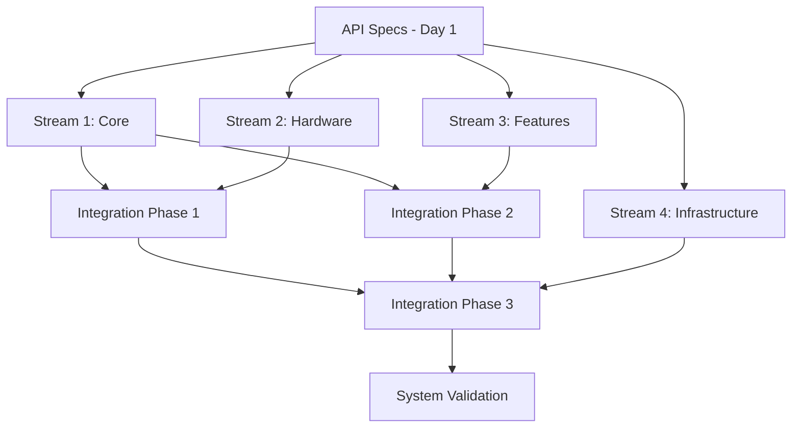

# Phase 3A: Detailed Parallel Task Breakdown

## Overview

This document provides the granular task breakdown for the aggressively parallel implementation of Phase 3A. Each task is designed for maximum independence to enable true concurrent development across the 4 parallel streams.

## Task Dependency Graph



## Stream 1: Core Infrastructure (Critical Path)

### Team Composition
- **Lead Developer**: Senior C developer with DOS experience
- **Module Engineer**: Specialist in dynamic loading
- **Memory Engineer**: Expert in DOS memory management

### Day-by-Day Task Breakdown

#### Day 1: Foundation & API Specification
**Duration**: 8 hours  
**Priority**: CRITICAL (blocking for all other streams)  
**Deliverable**: API specifications that unblock parallel development

##### Task 1.1: Module API Definition (2 hours)
```c
// Priority: CRITICAL - All streams depend on this
Subtasks:
- Define module_header_t structure
- Specify module initialization interface
- Define core_services_t API for modules
- Create module_ops_t vtable structure

Dependencies: None
Output: include/module_api.h
Team Member: Lead Developer
```

##### Task 1.2: Memory Management Interface (2 hours)
```c
// Define memory allocation APIs for modules
Subtasks:
- Memory allocation function signatures
- Buffer management interfaces
- XMS/UMB/conventional memory strategies
- Module memory layout specification

Dependencies: None  
Output: include/memory_api.h
Team Member: Memory Engineer
```

##### Task 1.3: Core Loader Architecture (2 hours)
```c
// Design core loader main structure
Subtasks:
- Main loader control structure
- Module registry design
- Loading state machine
- Error handling framework

Dependencies: None
Output: include/core_loader.h
Team Member: Module Engineer
```

##### Task 1.4: API Documentation & Distribution (2 hours)
```c
// Document and distribute APIs to all teams
Subtasks:
- API documentation with examples
- Interface usage guidelines
- Distribution to all stream leads
- Q&A session with team leads

Dependencies: Tasks 1.1, 1.2, 1.3
Output: API documentation + team briefings
Team Member: Lead Developer
```

#### Day 2-3: Core Infrastructure Implementation

##### Task 1.5: Module Manager Core (16 hours over 2 days)
```c
// Implement core module loading/unloading
Subtasks:
- Module discovery and enumeration
- Module header validation
- Module loading and relocation
- Module unloading and cleanup
- Module registry management

Dependencies: API specs from Day 1
Output: src/core/module_manager.c
Team Member: Module Engineer

Implementation Details:
- Module search path handling
- File I/O for module loading  
- Header checksum verification
- Memory allocation for modules
- Vtable binding mechanism
```

##### Task 1.6: Memory Management Implementation (16 hours over 2 days)
```c
// Implement sophisticated memory management
Subtasks:
- XMS memory detection and allocation
- UMB memory block management
- Conventional memory fallback
- Module memory layout optimization
- Memory debugging and leak detection

Dependencies: API specs from Day 1
Output: src/core/memory_manager.c
Team Member: Memory Engineer

Implementation Details:
- HIMEM.SYS interface
- Upper memory block enumeration
- Memory pool management
- Fragmentation prevention
- Performance optimization
```

##### Task 1.7: Core Loader Framework (16 hours over 2 days)
```c
// Implement main loader control logic
Subtasks:
- Command-line parsing
- Configuration management
- Main initialization sequence
- Module loading orchestration
- Error handling and recovery

Dependencies: Tasks 1.5, 1.6
Output: src/core/core_loader.c
Team Member: Lead Developer

Implementation Details:
- DOS command-line interface
- Configuration file parsing
- Initialization state machine
- Error reporting system
- Debug logging framework
```

#### Day 4-5: Integration and API Layer

##### Task 1.8: Packet Driver API Integration (16 hours over 2 days)
```c
// Integrate modular design with packet driver API
Subtasks:
- INT 60h handler implementation
- Handle management for modules
- Packet routing to appropriate modules
- Multi-application support
- API compliance verification

Dependencies: Core framework from Days 2-3
Output: src/core/packet_api.c
Team Member: Lead Developer

Implementation Details:
- Interrupt vector management
- Handle allocation/deallocation
- Packet type registration
- Application multiplexing
- Error code standardization
```

##### Task 1.9: Module Integration Testing (16 hours over 2 days)
```c
// Test framework for module integration
Subtasks:
- Mock module creation for testing
- Module loading/unloading tests
- Memory leak detection tests
- API compliance testing
- Performance baseline tests

Dependencies: All core components
Output: tests/core/integration_tests.c
Team Member: Module Engineer + Memory Engineer

Test Coverage:
- Module discovery and loading
- Memory allocation patterns
- Error handling scenarios
- API contract validation
- Performance regression detection
```

#### Day 6-7: Hardware Integration Preparation

##### Task 1.10: Hardware Module Support (16 hours over 2 days)
```c
// Prepare core for hardware module integration
Subtasks:
- Hardware detection coordination
- NIC family mapping implementation
- Hardware module registry
- Multi-NIC support framework
- Cache coherency integration (Phase 4)

Dependencies: Stream 2 hardware modules ready
Output: Enhanced core with hardware support
Team Member: All team members

Integration Points:
- Family-based module loading
- Multiple hardware module support
- Cache management coordination
- Performance optimization
- Error recovery mechanisms
```

## Stream 2: Hardware Modules (Parallel Track A)

### Team Composition
- **Hardware Lead**: Senior developer with NIC driver experience
- **EtherLink III Specialist**: 3C509 family expert  
- **Corkscrew Specialist**: 3C515 family expert
- **Hardware Test Engineer**: Real hardware validation

### Sub-Team A: ETHRLINK3.MOD Development

#### Day 2-3: 3C509 Base Implementation

##### Task 2A.1: Module Infrastructure (16 hours over 2 days)
```c
// Create ETHRLINK3 module foundation
Subtasks:
- Module header and initialization
- Family detection framework
- Common 3C509 hardware interface
- EEPROM reading infrastructure
- Media detection base code

Dependencies: Module API from Stream 1
Output: src/modules/hardware/ethrlink3/ethrlink3_main.c
Team Member: EtherLink III Specialist

Implementation Focus:
- Module header compliance
- Family-wide compatibility
- EEPROM interface standardization
- Media type enumeration
- Error handling framework
```

##### Task 2A.2: 3C509 Original Support (16 hours over 2 days)
```c
// Implement original 3C509 support
Subtasks:
- Original 3C509 detection
- PIO data transfer implementation
- Media selection (TP/Coax/AUI)
- Interrupt handling
- Error recovery

Dependencies: Task 2A.1
Output: src/modules/hardware/ethrlink3/3c509_original.c
Team Member: EtherLink III Specialist

Hardware Details:
- I/O port mapping
- Register access patterns
- Media selection logic
- Interrupt configuration
- Performance optimization
```

#### Day 4-5: 3C509B Enhanced Implementation

##### Task 2A.3: 3C509B Enhanced Features (16 hours over 2 days)
```c
// Implement 3C509B enhancements
Subtasks:
- Enhanced 3C509B detection
- Improved PIO performance
- Enhanced media detection
- Power management features
- Performance optimizations

Dependencies: Task 2A.2
Output: src/modules/hardware/ethrlink3/3c509b_enhanced.c
Team Member: EtherLink III Specialist

Enhancement Focus:
- Performance improvements
- Enhanced media support
- Better error detection
- Power management
- Compatibility maintenance
```

##### Task 2A.4: Family Integration Framework (16 hours over 2 days)
```c
// Create family-wide integration
Subtasks:
- Variant detection logic
- Common interface implementation
- Performance optimization across variants
- Family-specific configuration
- Testing framework

Dependencies: Tasks 2A.2, 2A.3
Output: Family integration and testing
Team Member: EtherLink III Specialist

Integration Features:
- Automatic variant detection
- Unified family interface
- Performance optimization
- Configuration management
- Comprehensive testing
```

#### Day 6-7: 3C509C and Family Completion

##### Task 2A.5: 3C509C Latest Support (16 hours over 2 days)
```c
// Implement 3C509C latest features
Subtasks:
- 3C509C specific detection
- Latest feature support
- Backwards compatibility
- Performance validation
- Complete family testing

Dependencies: Task 2A.4
Output: Complete ETHRLINK3.MOD
Team Member: EtherLink III Specialist + Hardware Test Engineer

Final Features:
- Complete family support
- Performance optimization
- Comprehensive testing
- Documentation
- Production readiness
```

### Sub-Team B: CORKSCREW.MOD Development

#### Day 2-4: 3C515 Base Implementation

##### Task 2B.1: Corkscrew Module Foundation (24 hours over 3 days)
```c
// Create CORKSCREW module foundation
Subtasks:
- Module header and initialization
- 3C515 family detection
- PCI interface implementation
- DMA framework setup
- Cache coherency preparation

Dependencies: Module API from Stream 1
Output: src/modules/hardware/corkscrew/corkscrew_main.c
Team Member: Corkscrew Specialist

Implementation Focus:
- PCI bus interface
- DMA capability detection
- Ring buffer framework
- Cache coherency integration
- Performance foundation
```

##### Task 2B.2: DMA Ring Buffer Implementation (24 hours over 3 days)
```c
// Implement sophisticated DMA ring management
Subtasks:
- TX/RX ring buffer allocation
- Descriptor management
- DMA address translation
- Buffer pool integration
- Performance optimization

Dependencies: Task 2B.1 + Memory API from Stream 1
Output: src/modules/hardware/corkscrew/corkscrew_dma.c
Team Member: Corkscrew Specialist

DMA Features:
- 16-descriptor rings
- Efficient buffer management
- Zero-copy operations
- Cache coherency compliance
- High-performance transfers
```

#### Day 5-7: Advanced Features and Integration

##### Task 2B.3: Cache Coherency Integration (24 hours over 3 days)
```c
// Integrate Phase 4 cache coherency
Subtasks:
- Cache management integration
- DMA coherency enforcement
- Performance tier utilization
- Cache-aware buffer management
- Validation and testing

Dependencies: Task 2B.2 + Phase 4 cache management
Output: Cache-coherent CORKSCREW.MOD
Team Member: Corkscrew Specialist + Hardware Test Engineer

Cache Integration:
- 4-tier cache management
- DMA buffer coherency
- Performance optimization
- Safety validation
- Production testing
```

### Hardware Integration and Testing

#### Day 6-7: Cross-Module Validation

##### Task 2.10: Multi-Module Hardware Testing (16 hours over 2 days)
```c
// Test both hardware modules together
Subtasks:
- Dual module loading tests
- Multi-NIC detection validation
- Resource conflict resolution
- Performance comparison
- Production readiness validation

Dependencies: Both ETHRLINK3.MOD and CORKSCREW.MOD complete
Output: Validated hardware module suite
Team Member: Hardware Test Engineer + both specialists

Validation Points:
- Module loading independence
- Hardware detection accuracy
- Resource usage optimization
- Performance benchmarking
- Production deployment readiness
```

## Stream 3: Feature Modules (Parallel Track B)

### Team Composition
- **Feature Lead**: Networking protocols expert
- **Routing Specialist**: Multi-NIC routing expert
- **Stats Specialist**: Performance monitoring expert
- **Tools Specialist**: Diagnostic and utility tools

### Sub-Team D: Core Features (ROUTING + FLOWCTRL)

#### Day 3-5: Routing Engine Implementation

##### Task 3D.1: Routing Engine Core (24 hours over 3 days)
```c
// Implement multi-NIC routing engine
Subtasks:
- Static routing table implementation
- Flow-aware routing logic
- Load balancing algorithms
- Route configuration interface
- Performance optimization

Dependencies: Core API from Stream 1
Output: src/modules/features/routing/routing_engine.c
Team Member: Routing Specialist

Routing Features:
- Static route management
- Flow-aware packet routing
- Load balancing across NICs
- Route priority handling
- Performance monitoring
```

##### Task 3D.2: Flow Control Implementation (24 hours over 3 days)
```c
// Implement 802.3x flow control
Subtasks:
- PAUSE frame detection
- Transmission throttling
- Flow control negotiation
- Congestion management
- Performance optimization

Dependencies: Core API from Stream 1  
Output: src/modules/features/flowctrl/flow_control.c
Team Member: Routing Specialist

Flow Control Features:
- IEEE 802.3x compliance
- PAUSE frame processing
- Congestion detection
- Throttling algorithms
- Network efficiency optimization
```

#### Day 6-7: Integration and Testing

##### Task 3D.3: Core Features Integration (16 hours over 2 days)
```c
// Integrate routing and flow control
Subtasks:
- Module integration testing
- Cross-feature functionality
- Performance validation
- Configuration management
- Production testing

Dependencies: Tasks 3D.1, 3D.2
Output: Integrated ROUTING.MOD and FLOWCTRL.MOD
Team Member: Routing Specialist

Integration Testing:
- Feature interaction validation
- Performance impact assessment
- Configuration compatibility
- Error handling verification
- Production readiness
```

### Sub-Team E: Statistics and Monitoring

#### Day 8-10: Statistics Implementation

##### Task 3E.1: Statistics Collection Engine (24 hours over 3 days)
```c
// Implement comprehensive statistics
Subtasks:
- Packet counter infrastructure
- Error classification system
- Performance metrics collection
- Historical data management
- Export functionality

Dependencies: Core API from Stream 1
Output: src/modules/features/stats/statistics.c
Team Member: Stats Specialist

Statistics Features:
- Per-NIC packet counters
- Error rate monitoring
- Performance metrics
- Historical trending
- Export capabilities
```

#### Day 11-12: Promiscuous Mode Support

##### Task 3E.2: Promiscuous Mode Implementation (16 hours over 2 days)
```c
// Implement promiscuous mode support
Subtasks:
- Promiscuous mode control
- Packet filtering bypass
- Monitoring tool integration
- Performance optimization
- Security considerations

Dependencies: Hardware modules from Stream 2
Output: src/modules/features/promisc/promiscuous.c
Team Member: Stats Specialist

Promiscuous Features:
- NIC promiscuous control
- Packet capture support
- Analysis tool integration
- Performance monitoring
- Security compliance
```

### Sub-Team F: Advanced Diagnostics

#### Day 8-11: Diagnostic Module Implementation

##### Task 3F.1: Diagnostic Framework (32 hours over 4 days)
```c
// Implement comprehensive diagnostics
Subtasks:
- Hardware diagnostic tests
- Cache coherency validation
- Performance benchmarking
- System analysis tools
- Report generation

Dependencies: All hardware modules + Phase 4 integration
Output: src/modules/features/diag/diagnostics.c
Team Member: Tools Specialist

Diagnostic Features:
- Hardware validation tests
- Cache coherency verification
- Performance benchmarking
- System configuration analysis
- Comprehensive reporting
```

## Stream 4: Infrastructure (Support Track)

### Team Composition
- **Build Engineer**: Module build system expert
- **Test Engineer**: Automated testing specialist
- **DevOps Engineer**: Integration and automation

### Day 2-4: Build System Infrastructure

##### Task 4.1: Module Linker Tools (24 hours over 3 days)
```c
// Create module build infrastructure
Subtasks:
- Module linker script development
- Module verification tools
- Checksum calculation utilities
- Module packaging system
- Build automation

Dependencies: Module format spec from Stream 1
Output: tools/module_linker, scripts/module.ld
Team Member: Build Engineer

Build Tools:
- Module-specific linker
- Header verification
- Checksum utilities
- Packaging automation
- Quality assurance
```

##### Task 4.2: Testing Framework (24 hours over 3 days)
```c
// Create automated testing infrastructure  
Subtasks:
- Unit test framework for modules
- Integration test harness
- Performance test suite
- Regression test automation
- Continuous integration setup

Dependencies: Core API from Stream 1
Output: tests/framework/, CI configuration
Team Member: Test Engineer

Testing Infrastructure:
- Automated unit testing
- Integration test suite
- Performance benchmarking
- Regression detection
- CI/CD pipeline
```

#### Day 5-8: Advanced Infrastructure

##### Task 4.3: Package and Distribution System (32 hours over 4 days)
```c
// Create distribution infrastructure
Subtasks:
- Distribution package creation
- Module dependency management
- Installation automation
- Update mechanism
- User documentation

Dependencies: All modules
Output: Distribution system and packages
Team Member: DevOps Engineer

Distribution Features:
- Automated packaging
- Dependency resolution
- Installation scripts
- Update mechanisms
- User-friendly deployment
```

#### Day 9-12: Integration and Validation

##### Task 4.4: System Integration Testing (32 hours over 4 days)
```c
// Comprehensive system validation
Subtasks:
- Full system integration tests
- Performance validation suite
- Memory usage verification
- Compatibility testing
- Production readiness assessment

Dependencies: All streams complete
Output: Validated system ready for production
Team Member: All infrastructure team

Final Validation:
- Complete system testing
- Performance verification
- Memory optimization validation
- Compatibility assurance
- Production deployment readiness
```

## Integration Timeline and Dependencies

### Critical Path Dependencies

```
Day 1: API Specs (Stream 1) → ALL OTHER STREAMS
Day 2: Core foundation → Hardware module development  
Day 3: Core API → Feature module development
Day 6: Hardware modules → Integration Phase 1
Day 8: Feature modules → Integration Phase 2
Day 10: All modules → Integration Phase 3
```

### Daily Integration Checkpoints

#### Daily Sync Schedule (All Streams)
```
08:00 - Daily standup (all stream leads, 15 minutes)
09:00 - Parallel development work begins
12:00 - Midday integration check (blocking issues only)
16:00 - End-of-day sync (15 minutes per stream)
17:00 - API evolution and dependency resolution
```

#### Integration Gate Criteria
```
Day 6 Gate: Core + Hardware Integration
- Core loader successfully loads both hardware modules
- Hardware detection works for both families
- Basic packet operations functional
- Memory usage within targets

Day 8 Gate: Core + Feature Integration  
- Feature modules load and initialize
- Cross-feature functionality works
- No resource conflicts detected
- Performance within acceptable range

Day 10 Gate: Full System Integration
- All modules integrate successfully
- Complete feature matrix functional
- Memory targets achieved
- Performance benchmarks met
- Production readiness validated
```

## Risk Management and Contingencies

### High-Risk Task Mitigation

#### Critical Path Risks
```
Risk: API specification delays
Mitigation: Pre-draft specs during design phase
Contingency: 4-hour emergency API workshop

Risk: Core loader integration issues
Mitigation: Daily integration testing starting Day 3
Contingency: Rollback to previous working version

Risk: Hardware module complexity
Mitigation: Senior developers on hardware teams
Contingency: Reduce module scope to essential features
```

#### Resource Allocation Flexibility
```
If Stream 1 (Core) behind: Reallocate from Stream 4
If Stream 2 (Hardware) behind: Reallocate from Stream 3
If Stream 3 (Features) behind: Defer DIAG.MOD to post-MVP
If Stream 4 (Infrastructure) behind: Manual processes temporarily
```

## Success Metrics and Validation

### Development Velocity Metrics
- **Daily commits**: Target >20 commits across all streams
- **Integration frequency**: Successful builds twice daily
- **Test coverage**: Maintain >90% throughout development
- **Bug detection**: <4 hour resolution for blocking issues

### Quality Gates
- **Unit tests**: >90% coverage per module
- **Integration tests**: >95% pass rate
- **Performance tests**: <5% regression from baseline
- **Memory tests**: Achieve 25-45% reduction targets

### Timeline Validation
- **Week 1 completion**: All streams 70%+ complete
- **Week 2 completion**: Integration phases successful
- **Week 3 completion**: System validation and optimization complete

## Conclusion

This detailed task breakdown enables true parallel development across 4 independent streams while maintaining strategic integration points. The aggressive timeline compression from 5 weeks to 2-3 weeks is achievable through:

1. **Maximum Parallelization**: 14 developers working concurrently
2. **Strategic Dependencies**: Minimal blocking dependencies between streams
3. **Continuous Integration**: Daily validation prevents integration problems
4. **Risk Mitigation**: Proactive identification and resolution of issues
5. **Quality Maintenance**: Continuous testing ensures no quality compromise

**Implementation Status**: Ready for immediate execution upon Phase 3A approval.